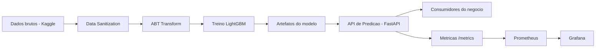

# MLOps - Entrega Individual (TCC)

## 1) Arquitetura funcional da solucao

A arquitetura proposta cobre o fluxo de ponta a ponta: origem dos dados, transformacao, treino, deploy e observabilidade.

### Componentes principais

1. Origem dos dados: Kaggle Home Credit (`Dados/raw_data.csv`)
2. Preparacao de dados:
   - `DataPipeline/data_sanitization.py`
   - `DataPipeline/abt_transform.py`
3. Treinamento de modelo:
   - `Model/train.py`
   - artefatos em `Model/artifacts/`
4. Serving de predicao (online):
   - `app/main.py` (FastAPI)
   - endpoint `POST /predict`
5. Observabilidade:
   - Prometheus coleta metricas do endpoint `/metrics`
   - Grafana para visualizacao de saude/performance
6. Orquestracao batch:
   - `MLOps/pipeline_orchestration.py` para encadear pipeline e treino

### Diagrama (alto nivel)



## 2) Infraestrutura com Docker Compose

O arquivo `MLOps/docker-compose.yml` sobe os servicos:

- `prediction-api`: API de inferencia em `http://localhost:8000`
- `prometheus`: monitoramento em `http://localhost:9090`
- `grafana`: dashboards em `http://localhost:3000` (`admin/admin`)
- `pipeline-orchestrator` (profile `batch`): executa pipeline ETL + treino de forma batch

### Subir ambiente online (predicao + monitoramento)

```bash
docker compose -f MLOps/docker-compose.yml up --build -d
```

### Rodar pipeline batch (sob demanda)

```bash
docker compose -f MLOps/docker-compose.yml --profile batch up --build pipeline-orchestrator
```

## 3) Monitoramento de dados e modelo em producao (proposta)

A implementacao atual expoe monitoramento tecnico minimo (latencia, volume e erros). Para producao, a evolucao recomendada e:

1. Falhas operacionais
   - Alertas por indisponibilidade do endpoint `/health`
   - Alertas por aumento de `creditguard_prediction_errors_total`
2. Performance do servico
   - Alertas de p95 de latencia (`creditguard_prediction_latency_seconds`)
   - Alertas por queda de throughput
3. Mudanca de comportamento dos dados (data drift)
   - Monitorar distribuicao de entradas criticas (`EXT_SOURCE_1/2/3`, `AMT_CREDIT`, `AMT_INCOME_TOTAL`)
   - Comparar janela de producao vs treino (PSI, KS)
4. Performance preditiva (model drift)
   - Quando houver rotulo real posterior (inadimplencia confirmada), calcular AUC/Recall por janela
   - Alerta de degradacao quando metricas cairem abaixo de limite de controle

## 4) Acoes automatizadas conectando ML + automacao + agentes de IA

### Regras automatizadas por faixa de risco

1. Baixo risco (`probability < 0.30`)
   - Aprovar automaticamente dentro de limite de alcada
2. Medio risco (`0.30 <= probability < 0.70`)
   - Abrir tarefa de analise complementar em fila de underwriting
3. Alto risco (`probability >= 0.70`)
   - Direcionar para revisao manual obrigatoria
   - Disparar checklist antifraude e solicitacao de documentos adicionais

### Agente de IA (proximo passo)

Proposta de um agente conectado a eventos de predicao:

1. Ler predicao e contexto do cliente
2. Gerar justificativa em linguagem de negocio (explicabilidade simplificada)
3. Recomendar proxima melhor acao para o analista
4. Criar automaticamente tarefas nos sistemas internos (CRM/BPM)

## 5) Proximos passos de desenvolvimento (itens iii e iv)

1. Persistir eventos de predicao em banco transacional
2. Criar jobs diarios para calcular drift de dados e desempenho do modelo
3. Implementar regras de re-treino automatico com aprovacao humana
4. Integrar agente de IA com canal operacional (Teams/Slack/CRM)
5. Adicionar trilha de auditoria para compliance de credito
